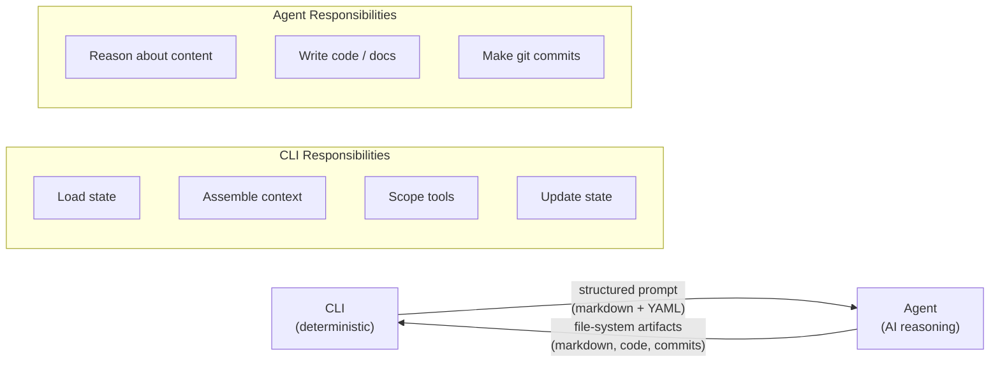
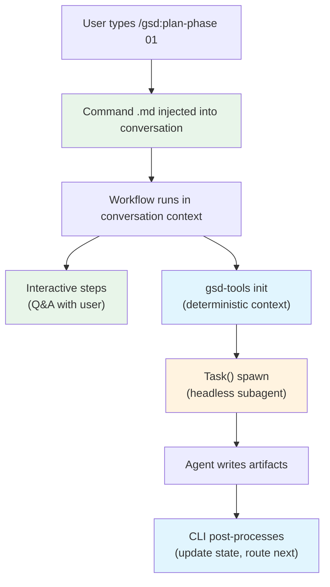
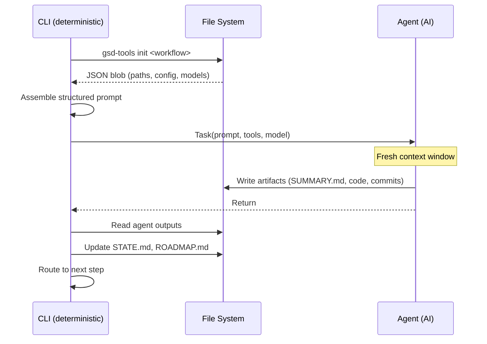
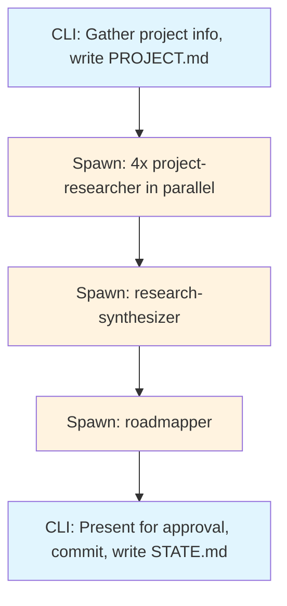
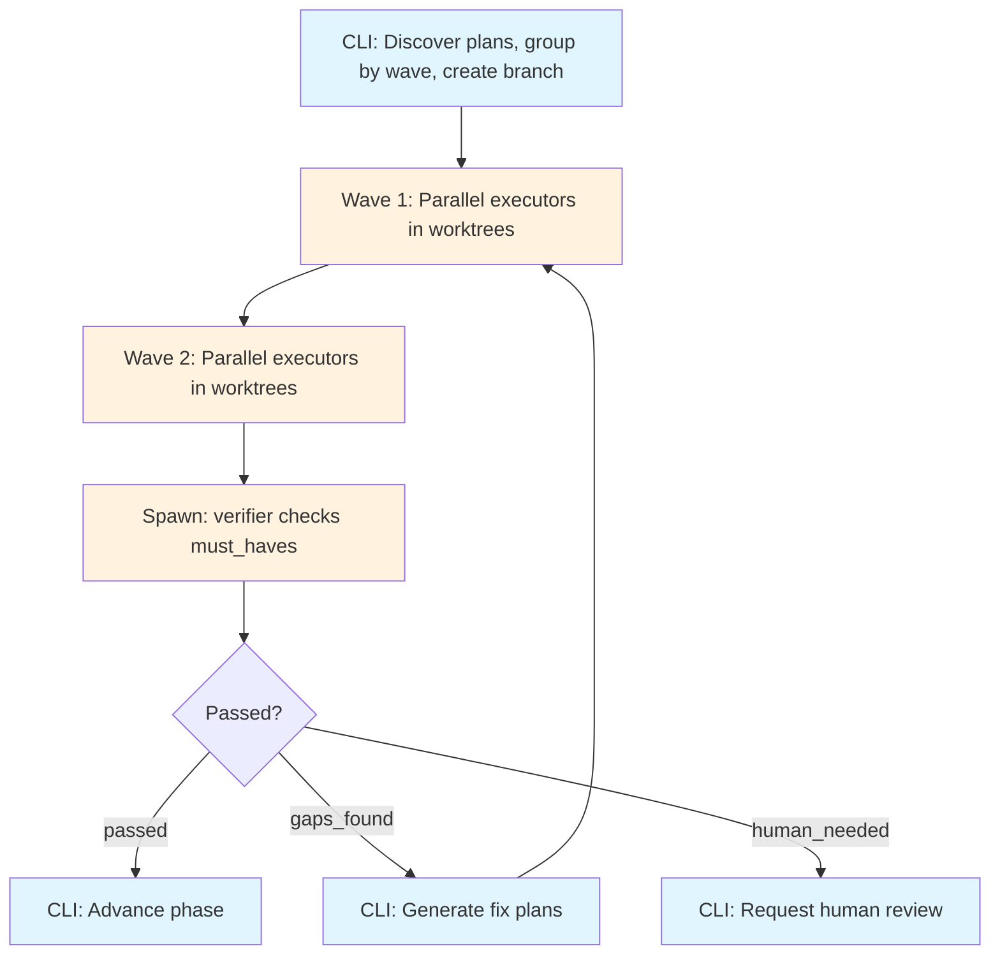
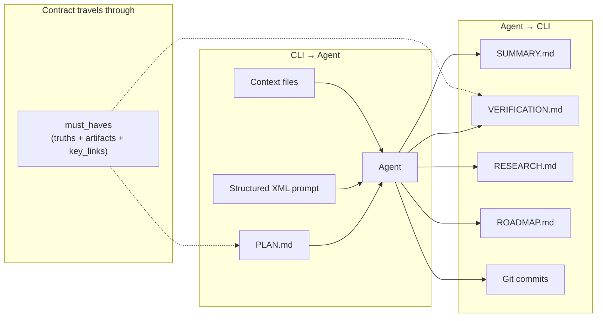

# GSD — The CLI-Agent Interaction Protocol

How [GSD](https://github.com/gsd-build/get-shit-done) coordinates between deterministic CLI tooling and AI agents. GSD achieves a sweet spot between complete determinism and complete AI autonomy through structured markdown documents that serve as the protocol boundary.

**Version researched:** 1.30.0 (2026-03-26)
**Research date:** 2026-03-27

---

## The Core Pattern

Every GSD operation follows the same interaction protocol:



The CLI never reasons about content. The agent never manages state. Structured markdown documents are how they talk to each other. This is the same pattern whether the operation is code execution, project planning, research, verification, or milestone creation.

---

## The Command Layer: Conversational Entry Point

The user's entry point to GSD is a **slash command** — `/gsd:plan-phase`, `/gsd:quick`, `/gsd:new-project`, etc. Each command is a `.md` file (YAML frontmatter + prompt body) that lives in `commands/gsd/`. When the user types a command, the markdown file gets injected into the **user's active coding agent session** — it becomes part of the conversation.

This means the interaction is **conversational from the start**. The command's markdown tells the agent what workflow to run, but the agent is still in a chat session with the user. Some workflows are interactive (like `discuss-phase`, which asks the user questions), some gather info conversationally before spawning headless subagents.



The command `.md` file has YAML frontmatter specifying metadata (name, description, allowed tools) and a prompt body containing the workflow logic. The command IS a structured document — the first structured prompt in the chain.

```yaml
# Example: commands/gsd/plan-phase.md
---
name: plan-phase
description: "Create execution plans for a development phase"
allowed-tools: [Read, Write, Bash, Grep, Glob, Task]
---

<workflow body — instructions for the agent>
```

This is important because the distinction isn't "CLI is deterministic, agent is headless." The distinction is:
- **Commands** are structured documents injected into a conversational session
- **Workflows** orchestrate within that session — some steps are interactive, some spawn headless subagents
- **`gsd-tools.cjs`** provides deterministic operations that both the conversational agent and headless subagents can call
- **Subagents** (spawned via `Task()`) are the only truly headless part — they get a fresh context, do work, and return

---

## The Five-Step Handshake (Within Workflows)

Once a command triggers a workflow, the workflow follows these steps for any operation that needs a headless subagent:



### Step 1: Deterministic Init

The CLI runs `gsd-tools init <workflow-name>` which returns a JSON blob containing everything the workflow needs: file paths, config flags, model assignments, state snapshots.

```bash
INIT=$(node gsd-tools.cjs init execute-phase "01")
```

This is implemented in `init.cjs` (1443 lines) with workflow-specific init functions:

| Init Function | Used By |
|---------------|---------|
| `cmdInitNewProject` | new-project |
| `cmdInitNewMilestone` | new-milestone |
| `cmdInitPlanPhase` | plan-phase |
| `cmdInitExecutePhase` | execute-phase, execute-plan |
| `cmdInitQuick` | quick |
| `cmdInitPhaseOp` | verify-phase, ship, research-phase, discuss-phase |
| `cmdInitProgress` | progress |
| `cmdInitMapCodebase` | map-codebase |
| `cmdInitMilestoneOp` | autonomous, complete-milestone |

### Step 2: Prompt Assembly

The workflow constructs a structured prompt from the init payload. The prompt includes:
- The agent definition (from `agents/*.md` — role, constraints, output format)
- Project context (state files, roadmap, requirements)
- The specific work item (a PLAN.md, a phase goal, a research focus)
- Tool permissions scoped to the agent's role

### Step 3: Agent Spawn

The workflow calls `Task()` (or `query()` in SDK mode) with the assembled prompt, agent definition, model, and tool permissions. Each spawn gets a **fresh context window** — no accumulated state from prior sessions.

```
Task(
  subagent_type="gsd-executor",
  model="{resolved_model}",
  isolation="worktree",
  prompt="<objective>...</objective>
         <execution_context>@file:workflow.md</execution_context>
         <files_to_read>STATE.md, ROADMAP.md</files_to_read>"
)
```

### Step 4: Agent Work

The agent reasons within the structured frame, produces file-system artifacts (markdown docs, code, git commits), and returns.

### Step 5: Deterministic Post-Processing

The CLI reads the agent's outputs from the file system, updates state files, and decides what happens next (advance to next phase, trigger verification, loop for gap closure, etc.).

---

## How Every Operation Uses This Pattern

### Project Creation (`new-project`)



| Step | What Happens |
|------|-------------|
| **CLI** | Gathers project info interactively, writes PROJECT.md, resolves models |
| **Spawn** | 4 parallel `gsd-project-researcher` agents (Stack, Features, Architecture, Pitfalls) — each gets a different research focus |
| **Agent** | Each researcher explores its focus area, writes a research report |
| **CLI** | Collects all 4 reports |
| **Spawn** | 1 `gsd-research-synthesizer` — receives all 4 reports |
| **Agent** | Synthesizes into consolidated RESEARCH.md |
| **CLI** | Collects synthesis |
| **Spawn** | 1 `gsd-roadmapper` — receives PROJECT.md + RESEARCH.md |
| **Agent** | Creates ROADMAP.md with phases, milestones, success criteria |
| **CLI** | Presents for approval, commits all artifacts, writes STATE.md |

### Phase Planning (`plan-phase`)

| Step | What Happens |
|------|-------------|
| **CLI** | Validates phase exists, loads state/roadmap/requirements/context |
| **Spawn** | Optional `gsd-phase-researcher` if `--research` flag |
| **Agent** | Researches phase-specific concerns |
| **CLI** | Collects research |
| **Spawn** | `gsd-planner` — receives all context |
| **Agent** | Creates PLAN.md files with YAML frontmatter (must_haves, waves, dependencies) + XML tasks |
| **CLI** | Collects plans |
| **Spawn** | `gsd-plan-checker` — validates plans against 10 quality dimensions |
| **Agent** | Returns validation report; if issues, planner re-invoked (up to 3 iterations) |
| **CLI** | Commits plans, suggests next step |

### Code Execution (`execute-phase`)



| Step | What Happens |
|------|-------------|
| **CLI** | Discovers plans, groups by wave, creates feature branch |
| **Spawn** | Per wave: parallel `gsd-executor` agents, each in isolated worktree |
| **Agent** | Reads PLAN.md tasks, writes code, runs `<verify>`, makes atomic git commits, writes SUMMARY.md |
| **CLI** | Collects summaries, merges worktrees |
| **Spawn** | `gsd-verifier` — checks goal achievement against must_haves |
| **Agent** | Verifies truths, artifacts (4 levels), key links; returns VERIFICATION.md |
| **CLI** | If gaps found: generates fix plans, re-executes, re-verifies. If passed: advances phase |

### Phase Verification (`verify-phase`)

| Step | What Happens |
|------|-------------|
| **CLI** | Loads phase context, collects must_haves from all plans |
| **Spawn** | `gsd-verifier` agent |
| **Agent** | Checks truths (observable behaviors), artifacts (exists/substantive/wired/data-flowing), key links (grep for patterns), scans anti-patterns |
| **CLI** | Processes result: `passed` / `gaps_found` / `human_needed`. Routes accordingly |

### Research (`research-phase`)

| Step | What Happens |
|------|-------------|
| **CLI** | Validates phase, resolves model |
| **Spawn** | `gsd-phase-researcher` with phase context + ROADMAP section |
| **Agent** | Explores, writes RESEARCH.md |
| **CLI** | Commits, suggests plan-phase as next step |

### Milestone Creation (`new-milestone`)

| Step | What Happens |
|------|-------------|
| **CLI** | Loads existing state, gathers milestone goals |
| **Spawn** | Optional 4 parallel researchers + synthesizer (same as new-project) |
| **Agent** | Research reports |
| **Spawn** | `gsd-roadmapper` — generates new phases for this milestone |
| **Agent** | Appends to ROADMAP.md |
| **CLI** | Updates STATE.md, commits |

### Codebase Mapping (`map-codebase`)

| Step | What Happens |
|------|-------------|
| **CLI** | Checks existing maps, detects runtime capabilities |
| **Spawn** | 4 parallel `gsd-codebase-mapper` agents (Tech, Architecture, Quality, Concerns) |
| **Agent** | Each maps its domain |
| **CLI** | Combines into CODEBASE-MAP.md, scans for leaked secrets, commits |

### Quick Mode (`quick`)

| Step | What Happens |
|------|-------------|
| **CLI** | Creates task directory, parses description |
| **Spawn** | Optional researcher, then `gsd-planner` (constrained to 1-3 tasks), then `gsd-executor` |
| **Agent** | Plans and executes in compressed cycle |
| **CLI** | Updates STATE.md, commits |

---

## Inline Operations (Conversational, No Subagent Spawn)

Some operations run entirely within the user's conversation — no headless subagent spawned. The command `.md` gets injected, the workflow loads context via `gsd-tools init`, and the work happens interactively:

| Operation | What It Does |
|-----------|-------------|
| `discuss-phase` | Interactive Q&A with user about ambiguities, writes CONTEXT.md |
| `ship` | Deterministic PR creation from planning artifacts |
| `transition` | Advances state between phases (internal, not user-facing) |
| `progress` | Generates status report with progress bar |
| `complete-milestone` | Archives milestone, writes retrospective, creates git tag |
| `fast` | Direct edit + commit for trivial changes (<=3 files) |
| `note` | Simple file append/list/promote |
| `do` | Intent dispatcher — routes freeform text to appropriate workflow |

These still follow the pattern of "CLI loads context deterministically, then work happens" — the difference is the work happens in the user's conversation rather than in a headless subagent. The agent can ask the user questions, show progress, and get feedback — all within the same chat session that the `/gsd:*` command was issued in.

---

## The Structured Document as Protocol

The key insight is that **structured markdown documents are the protocol boundary**. The CLI produces them, agents consume them, and agents produce them for the CLI to consume.



### CLI → Agent (Prompts)

PLAN.md files are the most visible example, but every agent-spawning workflow constructs a structured prompt:

```xml
<objective>
What the agent should achieve
</objective>

<execution_context>
@path/to/workflow-definition.md
</execution_context>

<files_to_read>
- STATE.md
- ROADMAP.md
- REQUIREMENTS.md
</files_to_read>

<success_criteria>
What constitutes success
</success_criteria>
```

The PLAN.md format adds task-level structure:

```yaml
---
phase: '01'
plan: '01'
type: execute
wave: 1
must_haves:
  truths: ["observable behavior that must be true"]
  artifacts: [{path: "file.ts", provides: "what it does"}]
  key_links: [{from: "a.ts", to: "b.ts", via: "import"}]
---
```

```xml
<tasks>
  <task type="auto">
    <files>src/auth.ts</files>
    <action>Natural language instructions</action>
    <verify>shell command to prove it worked</verify>
    <done>Human-readable completion statement</done>
  </task>
</tasks>
```

### Agent → CLI (Artifacts)

Agents produce file-system artifacts that the CLI reads deterministically:
- **SUMMARY.md** — execution results with YAML frontmatter (status, timestamps, task counts, commit hashes)
- **VERIFICATION.md** — verification results (passed/gaps_found/human_needed, truth statuses, artifact levels)
- **RESEARCH.md** — research findings
- **ROADMAP.md** — phase decomposition
- **Git commits** — atomic commits per task with conventional messages

### The Contract Within the Prompt

The `must_haves` section in PLAN.md frontmatter is a **machine-readable contract** embedded in the prompt:

- **Truths** — "what must be observably true when done" (success criteria)
- **Artifacts** — "what files must exist and be substantive" (deliverables)
- **Key Links** — "what connections must exist between artifacts" (integration checks)

The verifier agent reads these same `must_haves` and checks each one. The CLI then reads the verifier's output and routes accordingly. The contract travels through the entire pipeline as structured data.

---

## Tool Scoping: The Least-Privilege Layer

Part of the protocol is constraining what each agent CAN do:

| Agent Role | Allowed Tools |
|------------|--------------|
| Research | Read, Grep, Glob, Bash, WebSearch |
| Plan | Read, Write, Bash, Glob, Grep, WebFetch |
| Execute | Read, Write, Edit, Bash, Grep, Glob |
| Verify | Read, Bash, Grep, Glob |
| Check (read-only) | Read, Bash, Grep, Glob |

Researchers can search the web but can't write source files. Verifiers are read-only. Executors can write but have no web access. This is enforced at spawn time, not by agent self-discipline.

---

## The Three Execution Tiers

| Tier | Count | Pattern | Examples |
|------|-------|---------|----------|
| Agent-spawning | 7/19 | Conversational entry → init → Task() spawn → post-process | plan-phase, execute-phase, verify-phase, new-project, research, map-codebase, quick |
| Inline (conversational) | 10/19 | Conversational entry → init → work in user's chat session | discuss, ship, progress, transition, fast, note, milestone-complete |
| Orchestrator | 2/19 | Conversational entry → multi-agent coordination | autonomous (chains all phases), execute-phase (wave parallelism) |

All three tiers start with a **command `.md` injected into the user's conversation**. They all share the same init infrastructure (`gsd-tools init`) and file-based state model. The difference is whether the heavy work happens in the user's chat session (inline) or in headless subagents (spawned).

---

## Key Takeaways

The GSD interaction protocol demonstrates a general pattern for CLI-agent coordination:

1. **The CLI owns state and sequencing.** It decides what to do, assembles context, and processes results. The agent never manages workflow state.

2. **Structured documents are the interface.** Not function calls, not APIs — markdown with YAML frontmatter. Human-readable, git-diffable, debuggable.

3. **Fresh context per operation.** Each agent spawn gets exactly the context it needs, nothing more. No accumulated drift.

4. **Contracts travel with the prompt.** Success criteria (`must_haves`) are embedded in the same document the agent receives. The agent knows what "done" looks like because it's in the prompt.

5. **Verification is separate from execution.** The agent that writes code is not the agent that verifies it. Different context, different tools, different constraints.

6. **Tool scoping enforces the boundary.** The CLI doesn't trust the agent to stay in its lane — it restricts the available tools at spawn time.
